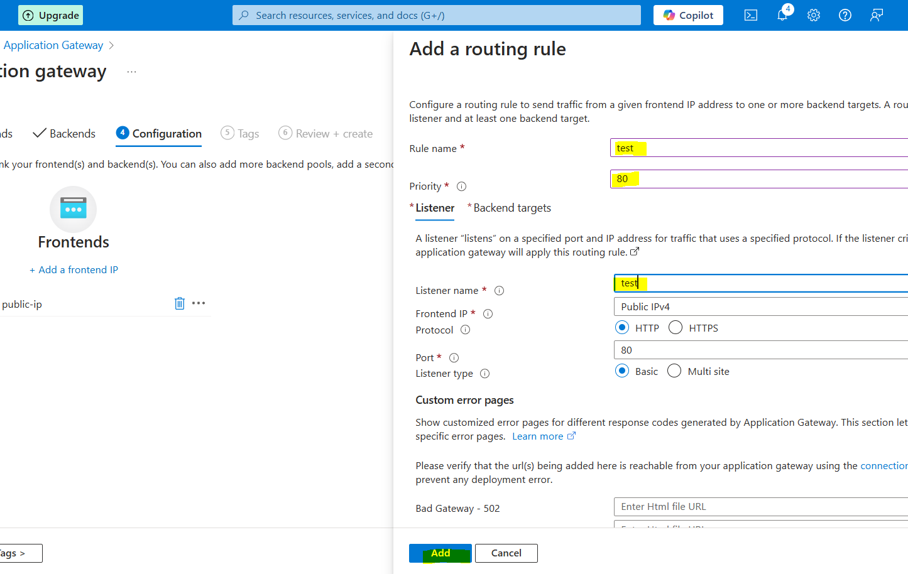

# Configure-Azure-Application-Gateway

### **Summary: Deploying Azure Application Gateway for Load Balancing**  

In this project, I configured **Azure Application Gateway** to securely route traffic to a web application. The steps include:  

- **Creating a Virtual Network (VNet)** with **two subnets**:  
  - One for the **Application Gateway**.  
  - One for the **Application (VMs hosting the website)**.  
- **Deploying a Virtual Machine (VM)** in the application subnet.  
- **Connecting to the VM via RDP** and installing the **IIS server** to host a dummy website.  
- **Configuring the Application Gateway** to route traffic to the IIS server.  
- **Retrieving the Public IP of the Application Gateway** to access the hosted website.  

This setup enables **secure, scalable, and efficient web traffic management** using Azure's **Layer 7 load balancing**. 🚀

## Step - 1 

i. Create a virtual Network

ii. I have reserved 64 Ip address for the virtual machine and 64 for the application gateway

iii. Once the virtual Network is done , Lets create a VM , make sure you selected this ports.

iv. Deploy the VM in subnet that you created

## Step- 2 

i. Connect your VM with the RDP

ii. Go into server manager , then click on add roles and features

iii. Install Web Server IIS 

## Step - 3

i. Create Application Gateway, select your virtual network then click on Manage subnet configuration

ii. Click on + subnet , give the name and the left 64 ip address will be asign to this application gateway

iii. Now you can see your subnet is added

iv. Once the basic is configure lets configure the frontends, Just give the public ip name

v. In backend , click on Add backend pool then configure as per shown in the image

vi. host a demo webiste on Web server IIS

vii. Lets configure the configuration part

